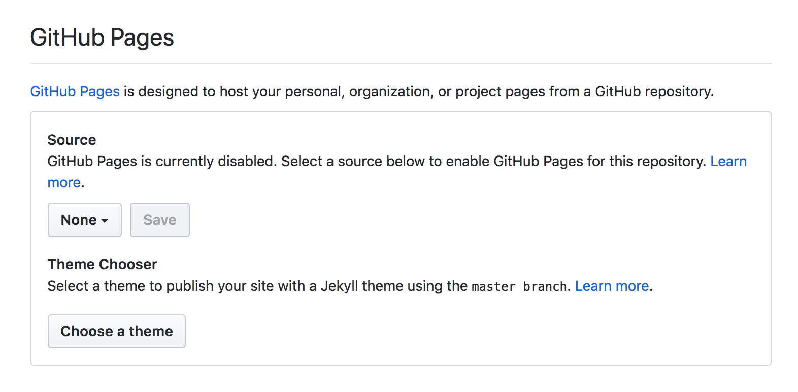

# Tuning and spinup of NorESM3

## Introduction

<!--
This little guide demonstrates how to turn any [Github](http://github.com) repository with a bunch of [Markdown](https://en.wikipedia.org/wiki/Markdown) files into a simple website using [Github Pages](https://pages.github.com/) and [Jekyll](https://jekyllrb.com/).

* You don't need to use the command line or anything other than your browser.
* It doesn't require any knowledge in Jekyll.
* It's completely compatible with any bunch of markdown files you already have in any existing repository without any modification to those files. That includes the basic `README.md` almost all repositories contain.
* The markdown files will remain just as readable and usable in Github than in your website.
-->

In fact this guide uses the same configuration and can be read both in Github and in Github Pages, at your preference:

* [Here is the link to the Github version](https://github.com/DirkOlivie/spinup-noresm3)
* [Here is the link to the Github Pages version](https://dirkolivie.github.io/spinup-noresm3/)

## Overview of simulations

### Determine the repository where you want to activate Github Pages

## Usage guide

## Recipes

Since the purpose of this guide is to demonstrate how to publish multiple Markdown files as a website but I don't have much more to say I will propose to you some delicious recipes instead:

* [Experiments](./recipes/Experiments.md)
* [Parameters](./recipes/Parameters.md)
* [People](./recipes/People.md)

## Contributing

See the [Contribution Guide](./CONTRIBUTING.md).

## License

See the [License File](./LICENSE.md).
